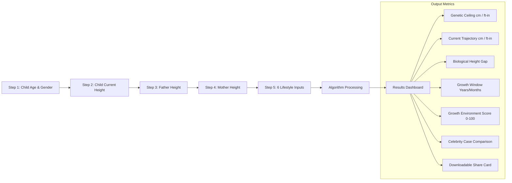

# 🌱 Lambai (लंबाई) — Pediatric Height Growth Platform & Genetic Potential Calculator

<p align="center">
  
</p>

<p align="center">
  <strong>"Every inch belongs to him."</strong><br>
  India's first science-backed pediatric height growth optimisation platform and genetic potential calculator designed specifically for Indian parents to maximize their son's natural biological growth window before epiphyseal plates fuse.
</p>

<p align="center">
  <a href="https://lambai.in"></a>
  <a href="#tech-stack"></a>
  <a href="#tech-stack"></a>
  <a href="#tech-stack"></a>
  <a href="#tech-stack"></a>
  <a href="#tech-stack"></a>
  <a href="#license"></a>
</p>

---

## 📌 Repository About & Topics

For easy copy-pasting directly into your **GitHub Repository Settings**:

### 📝 About Description
```text
🌱 India's first science-backed pediatric height growth optimisation platform & genetic ceiling calculator for boys aged 2–17. Built with Next.js 16, React 19, TypeScript, Tailwind CSS v4, and Supabase.
```

### 🌐 Website URL
```text
https://lambai.in
```

### 🏷️ Topic Tags
```text
height-calculator, pediatric-health, growth-tracker, nextjs, nextjs16, react19, typescript, tailwindcss, framer-motion, supabase, lenis-scroll, indian-healthtech, child-nutrition, growth-plates, healthtech
```

---

## 📖 Table of Contents

- [🌟 Overview & Mission](#-overview--mission)
- [🔬 The Science Behind Lambai](#-the-science-behind-lambai)
- [✨ Key Features & Web Experience](#-key-features--web-experience)
- [📐 Genetic Height Potential Calculator Engine](#-genetic-height-potential-calculator-engine)
- [📱 Route Architecture & Pages](#-route-architecture--pages)
- [🛠️ Tech Stack](#-tech-stack)
- [📂 Project Directory Structure](#-project-directory-structure)
- [🚀 Getting Started & Local Development](#-getting-started--local-development)
- [🔐 Environment Configuration](#-environment-configuration)
- [🎨 Design System & Aesthetic Philosophy](#-design-system--aesthetic-philosophy)
- [📈 SEO, Metadata & Analytics](#-seo-metadata--analytics)
- [⚠️ Medical Disclaimer](#-medical-disclaimer)
- [📄 License](#-license)

---

## 🌟 Overview & Mission

Genetics accounts for **60% to 80%** of a child's final adult height. The remaining **20% to 40%** is determined by environmental factors: bioavailable micronutrient density, mechanical bone-loading stimulus, and slow-wave sleep growth hormone (HGH) secretion.

In India, typical dietary patterns often lack critical bioavailable calcium, zinc, lysine, and quality amino acids needed during growth spurts. When boys reach late adolescence (approx. 16–18 years), their **epiphyseal growth plates permanently fuse (ossify)**, closing their biological growth window forever.

> *"Sachin Tendulkar is 5'4". His son Arjun stands at 6'1". That is not luck. That is a system. Lambai gives every Indian parent access to that system."*

**Lambai Web** is the digital flagship and pre-launch interactive portal for Lambai:
1. **Democratises Pediatric Growth Science** — Translates clinical endocrinology and pediatric growth data into accessible, actionable guidance.
2. **Interactive Genetic Ceiling Calculator** — Evaluates maternal/paternal heights and 6 core lifestyle metrics to compute the child's genetic ceiling, current trajectory, lifestyle penalties, and growth window remaining.
3. **High-Converting Waitlist Bridge** — Built-in Supabase integration to capture and manage high-intent early access parent requests.
4. **Cinematic Dark Luxury Editorial Design** — An intentional aesthetic combining Aesop-level restraint with Linear-grade engineering polish.

---

## 🔬 The Science Behind Lambai

### 1. Tanner Mid-Parental Height Formula
Calculates the child's genetic target ceiling:

$$\text{Mid-Parental Height (cm)} = \frac{\text{Father's Height (cm)} + \text{Mother's Height (cm)} + 13\text{ cm}}{2} + 2.5\text{ cm}$$

$$\text{Genetic Ceiling Target Range} = \text{Mid-Parental Height} \pm 8.5\text{ cm}$$

### 2. NFHS-5 Indian Pediatric Growth Curves
Unlike generic Western datasets, Lambai benchmarks development against empirical **National Family Health Survey (NFHS-5)** pediatric medians to deliver culturally precise percentile projections.

### 3. The 3 Growth Pillars
- **🥗 Nutrition & Micronutrients**: Targeted intake of bioavailable calcium (Ragi, Til, Paneer), Vitamin D3/K2, Zinc, and high-biological-value proteins for osteoid matrix synthesis.
- **🏃 Mechanical Bone-Loading**: Micro-impact loading (jump rope, sprinting, bar hangs) activating osteoblasts and epiphyseal chondrocytes.
- **🌙 Deep Slow-Wave Sleep**: Optimizing Stage 3/4 NREM sleep architecture where 75%+ of daily pulsatile Human Growth Hormone (HGH) is released.

---

## ✨ Key Features & Web Experience

| Feature | Description |
|---|---|
| 📐 **Interactive 5-Step Calculator** | Instant calculation of genetic height ceiling, trajectory gap, habit score, and growth window countdown. |
| 🎴 **Exportable Growth Share Card** | One-tap share card generation powered by `html2canvas` for WhatsApp and social sharing. |
| 🍱 **Features Bento Grid** | Interactive showcase highlighting the Indian Superfood Matrix, Circadian Sleep, and Bone-Loading Mechanics. |
| 💫 **Lenis Smooth Scroll & Framer Motion** | Cinematic momentum scrolling coupled with GSAP and Framer Motion micro-animations. |
| 🛡️ **Grain Overlay & Custom Cursor** | Subtle film grain and interactive desktop magnetic custom cursor for a tactile luxury feel. |
| ⚡ **Supabase Waitlist Capture** | Real-time email validation, duplicate detection, and direct storage in Supabase `waitlist` tables. |
| 📊 **PostHog Funnel Tracking** | Client-side tracking measuring calculator completion rates, drop-offs, and conversions. |
| 📱 **100% Responsive & Zero Bloat** | Pure bespoke components crafted with Tailwind CSS v4 — zero bulky UI component libraries. |

---

## 📐 Genetic Height Potential Calculator Engine

The client-side calculator located at [`/calculator`](https://lambai.in/calculator) runs completely on-device for maximum speed and privacy:



### Lifestyle Metrics Analyzed:
- **Sleep Duration & Bedtime** (Circadian GH release)
- **Daily Physical Activity** (Osteoblast bone-loading)
- **Protein Frequency** (Amino acid bone matrix building blocks)
- **Late-Night Screen Time** (Blue light melatonin suppression)
- **Direct Sunlight Exposure** (Endogenous Vitamin D synthesis)
- **Calcium Intake Frequency** (Mineral bone density support)

---

## 📱 Route Architecture & Pages

- **`/` — Landing Page (`src/app/page.tsx`)**:
  - `Hero`: Punchy typography, dynamic background glow, instant CTA.
  - `ScrollMarquee`: Continuous scientific proof ticker.
  - `TheProblem`: The silent height crisis in modern India.
  - `TheInsight`: Why elite Indian dynasties grow taller than their fathers.
  - `TheEnemy`: Exposing sugar-loaded malt drinks (Horlicks/Bournvita).
  - `TheSystem`: The 3-pillar protocol breakdown.
  - `FeaturesBento`: Visual feature matrix with mockups.
  - `TheMission` & `CalculatorCTA`: Seamless bridge to the calculator and waitlist.
- **`/calculator` — Interactive Assessment (`src/app/calculator/`)**:
  - Multi-step client assessment with animated transitions.
  - Interactive metric comparison bars and visual growth trajectories.
  - `ShareCard`: Dynamic preview and PNG download for parents.
- **`/privacy` & `/terms` — Legal & Transparency (`src/app/privacy/`, `src/app/terms/`)**:
  - Zero-storage client privacy policy and disclaimers.

---

## 🛠️ Tech Stack

### Core Framework & Runtime
- **Framework**: [Next.js 16.2 (App Router)](https://nextjs.org/)
- **Library**: [React 19.2](https://react.dev/)
- **Language**: [TypeScript 5.x](https://www.typescriptlang.org/)
- **Styling**: [Tailwind CSS v4](https://tailwindcss.com/) with PostCSS
- **Bundler / Server**: Next.js Server Components & Turbopack ready

### Animation & Interaction
- **Motion & Stagger**: [Framer Motion 12](https://www.framer.com/motion/)
- **Scroll Sequences**: [GSAP 3](https://greensock.com/gsap/) & [`@gsap/react`](https://gsap.com/resources/React/)
- **Smooth Momentum Scrolling**: [Lenis 1.3](https://lenis.darkroom.engineering/)
- **Intersection Observer**: `react-intersection-observer`

### Backend, Database & Storage
- **Backend-as-a-Service**: [Supabase JS Client v2](https://supabase.com/docs/reference/javascript)
- **Client Canvas Generation**: [html2canvas](https://html2canvas.hertzen.com/) (PNG Share Card creation)

### Typography & Icons
- **Headings / Display**: `Outfit` (via `next/font/google`)
- **Body & Metrics**: `Inter` (via `next/font/google`)
- **Graphics**: Custom SVGs & bespoke UI design

---

## 📂 Project Directory Structure

```text
lambai-web/
├── public/                     # Static assets and media
│   ├── images/                 # Product mockups, hero visuals, brand logos
│   ├── favicon.ico             # Site favicon
│   ├── llms.txt                # Contextual documentation for LLMs / crawlers
│   └── *.svg                   # Brand icons and vector shapes
├── src/
│   ├── app/                    # Next.js App Router route hierarchy
│   │   ├── calculator/         # Height Potential Calculator route
│   │   │   ├── CalculatorClient.tsx  # Dynamic multi-step quiz & result engine
│   │   │   └── page.tsx        # Server-rendered calculator page wrapper
│   │   ├── privacy/            # Privacy Policy page
│   │   │   └── page.tsx
│   │   ├── terms/              # Terms and Conditions page
│   │   │   └── page.tsx
│   │   ├── globals.css         # Tailwind v4 directives & color design tokens
│   │   ├── layout.tsx          # Root layout with fonts, Lenis, grain, & JSON-LD
│   │   └── page.tsx            # Main landing page
│   ├── components/             # Custom modular component library
│   │   ├── calculator/         # Calculator sub-components
│   │   │   └── ShareCard.tsx   # Canvas-rendered shareable height result card
│   │   ├── landing/            # Landing page sections
│   │   │   ├── CalculatorCTA.tsx     # Direct calculator bridge button
│   │   │   ├── FeaturesBento.tsx     # Interactive feature matrix bento grid
│   │   │   ├── Hero.tsx              # Main hero with headline & CTA
│   │   │   ├── ScrollMarquee.tsx     # Continuous animated statement ticker
│   │   │   ├── StatementSection.tsx  # High-impact quote highlight
│   │   │   ├── TheEnemy.tsx          # Deconstruction of sugar drinks
│   │   │   ├── TheInsight.tsx        # The celebrity & elite family growth insight
│   │   │   ├── TheMission.tsx        # Lambai 10-year generation mission
│   │   │   ├── TheProblem.tsx        # Indian height gap statistics
│   │   │   ├── TheSystem.tsx         # 3-pillar protocol explanation
│   │   │   └── WaitlistForm.tsx      # Email input with Supabase sync
│   │   ├── layout/             # Global layout elements
│   │   │   ├── Footer.tsx            # Site footer with links and disclaimer
│   │   │   ├── LenisProvider.tsx     # Smooth scroll wrapper
│   │   │   └── Navbar.tsx            # Dynamic glassmorphic navigation header
│   │   └── ui/                 # Reusable micro-UI elements
│   │       ├── CustomCursor.tsx      # Interactive desktop cursor
│   │       └── GrainOverlay.tsx      # Cinematic ambient film grain overlay
│   └── lib/                    # Utilities & business logic
│       ├── animations.ts       # Shared Framer Motion animation variants
│       ├── calculator.ts       # Tanner formula & habit score math engine
│       ├── supabase.ts         # Supabase client initialization
│       └── utils.ts            # Class merging utility (clsx + twMerge)
├── eslint.config.mjs           # ESLint configuration
├── next.config.ts              # Next.js runtime configuration
├── package.json                # Project dependencies and scripts
├── postcss.config.mjs          # PostCSS configuration for Tailwind v4
└── tsconfig.json               # TypeScript strict configuration
```

---

## 🚀 Getting Started & Local Development

### Prerequisites
- **Node.js**: `v18.18.0` or higher (Node 20+ recommended)
- **Package Manager**: `npm`, `pnpm`, `yarn`, or `bun`

### Installation

1. **Clone the repository:**
   ```bash
   git clone https://github.com/ParitoshSrivastava31/Lambai.git
   cd Lambai/web
   ```

2. **Install dependencies:**
   ```bash
   npm install
   ```

3. **Set up Environment Variables:**
   Create a `.env.local` file in the `web` root directory:
   ```bash
   cp .env.example .env.local  # Or create .env.local directly
   ```

4. **Start the local development server:**
   ```bash
   npm run dev
   ```

5. **Open in browser:**
   Navigate to [http://localhost:3000](http://localhost:3000) to view the live site.

### Build & Production
```bash
# Generate optimized production build
npm run build

# Start production server locally
npm run start

# Run ESLint validation
npm run lint
```

---

## 🔐 Environment Configuration

Create a `.env.local` file with the following keys:

```env
# Supabase Configuration (Required for waitlist submissions)
NEXT_PUBLIC_SUPABASE_URL=https://your-project.supabase.co
NEXT_PUBLIC_SUPABASE_ANON_KEY=your-anon-key-here

# PostHog Analytics (Optional)
NEXT_PUBLIC_POSTHOG_KEY=your-posthog-key
NEXT_PUBLIC_POSTHOG_HOST=https://app.posthog.com
```

---

## 🎨 Design System & Aesthetic Philosophy

Lambai is styled with a **"Warm Editorial Luxury"** aesthetic (Aesop meets Linear):

- **Void Black (`#0A0A0A` / `--color-void`)**: Deep, immersive backdrop minimizing visual fatigue.
- **Deep Forest Green (`#1B4332`)**: Represents organic biological growth, vitality, and health.
- **Sovereign Gold (`#D4AF37` / `--color-gold`)**: Accents representing excellence, ambition, and premium care.
- **Surface Elevation (`#141414` / `#1F1F1F`)**: High-contrast card surfaces with subtle borders (`rgba(255,255,255,0.08)`).
- **Typography Pairing**:
  - `Outfit` — Geometric, high-character display headings.
  - `Inter` — Crisp, legible technical body and data readouts.

---

## 📈 SEO, Metadata & Analytics

- **Structured Data (JSON-LD)**: Built-in `Schema.org` WebSite and SearchAction markup for Google rich snippets.
- **OpenGraph & Twitter Cards**: Rich 1200x630 sharing cards configured in `src/app/layout.tsx`.
- **Search Engine Friendly**: Fully rendered server components with canonical tags and crawler directives.
- **LLM Discoverability**: Includes [`public/llms.txt`](./public/llms.txt) for semantic AI crawler discovery.

---

## ⚠️ Medical Disclaimer

*Lambai and the Genetic Height Potential Calculator are built for educational, informational, and wellness tracking purposes only. Predictions and recommendations are derived from standard pediatric statistical models (Tanner Mid-Parental Formula) and public health datasets (NFHS-5). Lambai does not provide medical diagnoses, pediatric treatment, or clinical prescriptions. Always consult a qualified pediatrician or pediatric endocrinologist for clinical assessments regarding your child's physical growth.*

---

## 📄 License

This repository and its contents are proprietary and confidential.  
© 2026 Lambai. All rights reserved. Unauthorized copying, modification, distribution, or commercial use is strictly prohibited.
